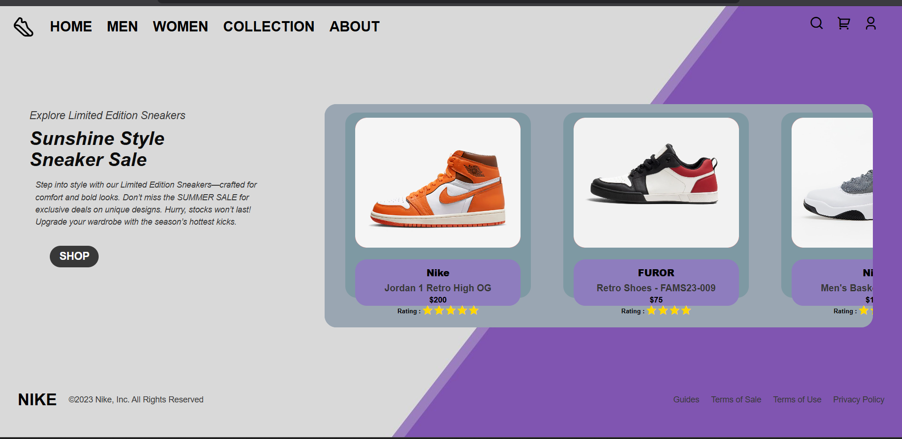

# 👟 Nike - Fully Responsive Product Page

✨ A sleek and modern product page showcasing stylish Nike sneakers, built purely with **HTML** and **CSS**, fully responsive for all devices.

---

## 🔖 Badges

  
  
  
  
  
  

---

## 📸 Preview

---

## 🚀 Live Demo

Check out the live demo of this project here:  
https://ayush-raghuwanshi-dev.github.io/NIKE-recreate/

---

## 🚀 Key Features

- ✅ Fully responsive layout adapting smoothly to mobile, tablet, and desktop screens  
- 🎨 Clean and modern UI design with intuitive navigation  
- ⭐ Star rating system using Remix Icons  
- 🛒 Interactive call-to-action button for shop  
- 🛠️ Mobile-first CSS media queries for performance  
- 📱 Horizontal scrollable shoe product cards on smaller screens

---

## 🛠️ Tech Stack

| Technology  | Purpose                           
|-------------|---------------------------------
| HTML5       | Page structure                  
| CSS3        | Styling and responsive design  
| Remix Icons | Icons for search, cart, user, stars 

---

## 📱 Responsive Design

This website is built using mobile-first principles and is optimized for:  
- 📱 Mobile devices  
- 💻 Tablets  
- 🖥️ Desktop screens  

---

## 👨‍💻 Author

**Ayush Raghuwanshi**  
B.Tech CSE Student | Passionate Frontend Developer  
[GitHub Profile](https://github.com/Ayush-Raghuwanshi-Dev)

---

## 📄 License

This project is licensed under the [MIT License](./LICENSE).

---

*Feel free to ⭐ the repository if you like this project!*
